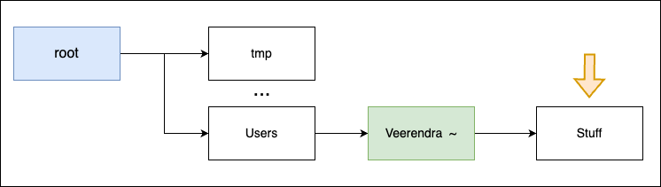
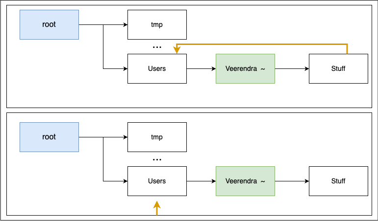
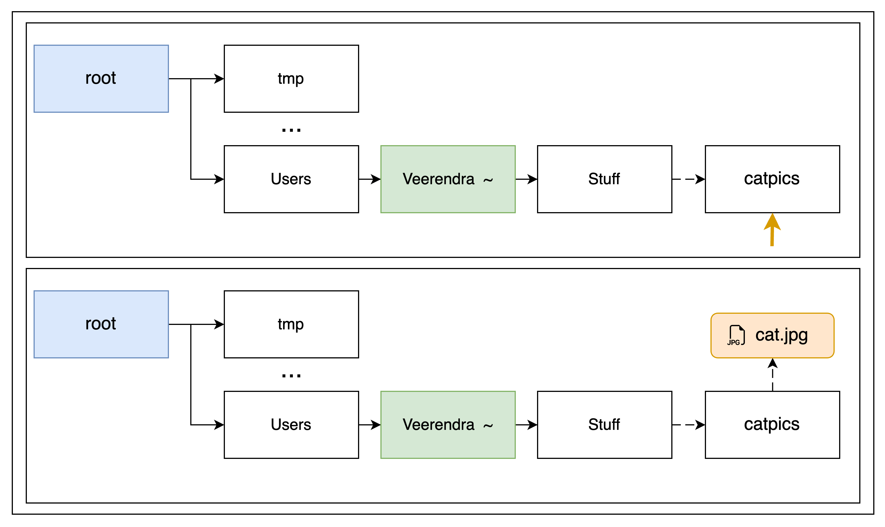

Linux Commands

## OS File Structure

Operating Systems organize their folders in a hierarchy (a tree) with parents and children, all relative to a base **root** directory.


Files and directories have **absolute paths** based on the root, where each additional level down adds a `"/"`. 
The absolute path for `Veerendra` is: `/Users/Veerendra`.

## How do I find out where I am?

Below is the image where the orange arrow points to the location where I am. To know that path we use the command `pwd` (**p**rint **w**orking **d**irectory) that tells you the full absolute path of where you're at!



```bash
$ pwd
/Users/Veerendra/Stuff
```

## Change Directory

### Navigating *Absolutely*

The command `cd` (**c**hange **d**irectory) followed by the absolute path of the directory you want to change to.



```bash
$ pwd 
/Users/Veerendra/Stuff

$ cd /Users

$ pwd
/Users
```

### Navigating *Relatively*

The dot `.` stands for currents directory, and dot-dot `..` stands for the parent directory. This allows for relative navigation.


```bash
$ pwd
/Users/Veerendra/Stuff

$ cd ../..

$ pwd
/Users
```
## What's Inside?
The keyword `ls` will **l**i**s**t the files and directories in the current directory. You can supply options such as `-a` to list **a**ll files (including hidden ones), or `-l` to list the files in a more readable format.

```bash
# List the files in the current directory
$ ls

# List the files and directories in the /Users/Veerendra/Stuff directory
$ ls /Users/Veerendra/Stuff

# List all the hidden files in the current directory
$ ls -a

# List the files in the current directory in a more readable format
$ ls -l
```
## Creating Directories

The command `mkdir` (**m**ake **k**ey **dir**ectory) followed by the name of the new directory will create a new child directory inside the current directory.

```bash
$ cd /Users/Veerendra/Stuff

$ mkdir catpics

$ ls
catpics

$ cd catpics

$ pwd
/Users/Veerendra/Stuff/catpics
```


## Creating Files

The command `touch` (**t**ouch) followed by the name of the new file will create a new file inside the current directory.

```bash 
$ cd /Users/Veerendra/Stuff/catpics

$ touch cat.jpg

$ ls
cat.jpg
```


## Moving / Renaming Things

Files can be moved or renamed using the `mv` (**m**o**v**e) keyword which takes two arguments: the source and the destination.

```bash
$ cd /Users/Veerendra/Stuff/catpics

# Rename the file cat.jpg to cat.png in the current directory (catpics)
$ mv cat.jpg cat.png

$ ls
cat.png
```


```bash
$ cd /Users/Veerendra/Stuff/catpics

# Move the file cat.png from the current directory (catpics) to the parent directory (Stuff)
$ mv cat.png ../

$ cd ..

$ ls
catpics cat.png
```


## Removing Files

Files can be deleted using the `rm` (**r**e**m**ove) keyword which takes one argument: the name of the file to be deleted.

```bash
$ cd /Users/Veerendra/Stuff

$ ls
catpics cat.png

$ rm cat.png

$ ls
catpics
```


## Removing Directories
Directories can also be removed using the `rm` keyword, with the added option `-r` (**r**ecursive). You can also use `-f` (**f**orce) to prevent warnings.

```bash
$ cd /Users/Veerendra/Stuff

$ ls
catpics

$ rm -rf catpics

$ ls
```


> [!WARNING]
> `rm -rf` is a dangerous command! Be extremely careful what folder you pass to it because you will never get it back!

